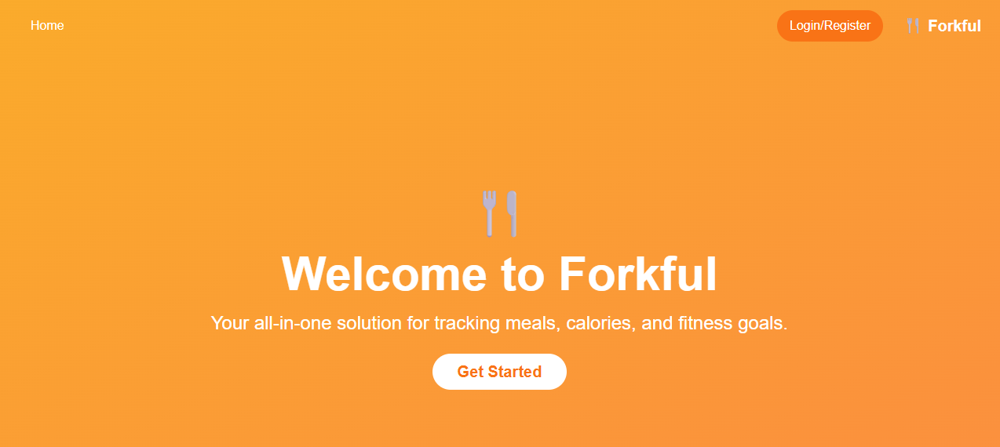

# Forkful: A Full-Stack Nutrition and Meal Tracking Application

This repository contains the source code for Forkful, a full-stack web application. The application provides a comprehensive solution for users to track their daily nutritional intake, manage a personal library of meals and ingredients, and monitor their progress toward fitness goals.



---

## Table of Contents

* [Project Overview](#project-overview)
* [Tech Stack](#-tech-stack)
* [Local Development Setup](#-local-development-setup)
  * [Prerequisites](#prerequisites)
  * [Installation & Configuration](#installation--configuration)
  * [Running the Application](#running-the-application)
* [Testing](#-testing)
  * [Backend Tests](#backend-tests)
  * [Frontend Tests](#frontend-tests)

---

## Project Overview

Forkful is designed to address the common challenge of manual nutrition tracking. It is built on a modern, decoupled architecture:

* **Django REST Backend:** A robust API built with Django and Django Rest Framework serves all data, manages user authentication, and handles all business logic related to nutrition, meals, and user profiles.
* **Vue.js Frontend:** A reactive Single Page Application (SPA) built with Vue 3 (using Vue CLI) provides a dynamic and responsive user interface. It communicates with the backend via RESTful API calls.
* **PostgreSQL Database:** A reliable, containerized PostgreSQL instance serves as the data store.
* **Dockerized Environment:** The entire application stack (backend, frontend, database) is containerized using Docker and managed with Docker Compose for consistent, one-command development and deployment.

---

## 🛠️ Tech Stack

| Category | Technology |
| :--- | :--- |
| **Backend** | Python, Django, Django Rest Framework (DRF) |
| **Frontend** | Vue 3, Vue CLI, Vue Router, Pinia (for state management), Tailwind CSS |
| **Database** | PostgreSQL |
| **DevOps** | Docker, Docker Compose |
| **Testing** | `unittest` (Django), Vitest, Vue Test Utils (Vue) |

---

## 🚀 Local Development Setup

The project is configured to run entirely within Docker containers.

### Prerequisites

* [Git](https://git-scm.com/downloads)
* [Docker Desktop](https://www.docker.com/products/docker-desktop/) (must be installed and running)

### Installation & Configuration

1.  **Clone the Repository**
    ```bash
    git clone [https://github.com/your-username/forkful.git](https://github.com/your-username/forkful.git)
    cd forkful
    ```

2.  **Create the Environment Configuration**
    The application uses a `.env` file at the project root to manage all environment variables and secrets. This file is intentionally not tracked by Git for security.

    A template file, `.env.example`, is provided. Copy it to create your local configuration:

    ```bash
    # On macOS/Linux
    cp .env.example .env

    # On Windows (PowerShell)
    Copy-Item .env.example .env
    ```
    This file contains all necessary defaults for the Docker environment to function. You may inspect this file and change `DB_PASSWORD` to a custom secure password if desired.

### Running the Application

1.  **Build and Start the Containers**
    This command will build the `backend` and `frontend` images, pull the `postgres` image, and start all three services in detached mode (`-d`).

    ```bash
    docker-compose up --build -d
    ```
    *(If you wish to see the logs in real-time, omit the `-d` flag.)*

2.  **Run Database Migrations**
    The first time you start the application, you must apply the database schema.

    ```bash
    docker-compose exec backend python manage.py migrate
    ```

3.  **(Optional) Create a Superuser**
    To access the Django admin interface, create an administrator account:

    ```bash
    docker-compose exec backend python manage.py createsuperuser
    ```

**The application is now running and accessible at the following locations:**

* **Frontend Application:** [http://localhost:8080](http://localhost:8080)
* **Backend API:** [http://localhost:8000/api/](http://localhost:8000/api/)
* **Backend Admin Panel:** [http://localhost:8000/admin/](http://localhost:8000/admin/)

---

## 🧪 Testing

The test suites for both the backend and frontend are also designed to run inside their respective Docker containers.

### Backend Tests

To execute the Django/Python unit test suite, run:

```bash
docker-compose exec backend python manage.py test
```

### Frontend Tests

To execute the Vue/Vitest unit test suite, run:

```bash
docker-compose exec frontend npm run test:unit
```